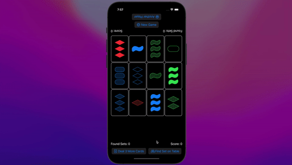

 # 📱Set Card Game in SwiftUI:
 

## 🗂Required Tasks:
 
✅ Implement a game of solo (i.e. one player) Set.  
✅ As the game play progresses, try to keep all the cards visible and as large as possible. In other words, cards should get smaller (or larger) as more (or fewer) appear on- screen at the same time. It’s okay if you want to enforce a minimum size for your cards and then revert to scrolling when there are a very large number of cards. Whatever way you deal with “lots of cards†on screen, it must always still be possible to play the game (i.e. cards must always be recognizable, even when all 81 are in play at the same time).  
✅ Cards can have any aspect ratio you like, but they must all have the same aspect ratio at all times (no matter their size and no matter how many are on screen at the same time). In other words, cards can be appearing to the user to get larger and smaller as the game goes on, but the cards cannot be “stretching†into different aspect ratios as the game is played.  
✅ The symbols on cards should be proportional to the size of the card (i.e. large cards should have large symbols and smaller cards should have smaller symbols).  
✅ Users must be able to select up to 3 cards by touching on them in an attempt to make a Set (i.e. 3 cards which match, per the rules of Set). It must be clearly visible to the user which cards have been selected so far.  
✅ After 3 cards have been selected, you must indicate whether those 3 cards are a match or mismatch. You can show this any way you want (colors, borders, backgrounds, whatever). Anytime there are 3 cards currently selected, it must be clear to the user whether they are a match or not (and the cards involved in a non-matching trio must look different than the cards look when there are only 1 or 2 cards in the selection).  
✅ Support “deselection†by touching already-selected cards (but only if there are 1 or 2 cards (not 3) currently selected).  
✅ When any card is touched on and there are already 3 matching Set cards selected, then ...  
 - a. as per the rules of Set, replace those 3 matching Set cards with new ones from the deck  
 - b. if the deck is empty then the space vacated by the matched cards (which cannot be replaced since there are no more cards) should be made available to the remaining cards (i.e. which may well then get bigger)  
 - c. if the touched card was not part of the matching Set, then select that card  
 - d. if the touched card was part of a matching Set, then select no card  

✅ When any card is touched and there are already 3 non-matching Set cards selected, deselect those 3 non-matching cards and select the touched-on card (whether or not it was part of the non-matching trio of cards).  
✅ You will need to have a “Deal 3 More Cards†button (per the rules of Set).  
 - a. when it is touched, replace the selected cards if the selected cards make a Set  
 - b. or, if the selected cards do not make a Set (or if there are fewer than 3 cards selected, including none), add 3 new cards to join the ones already on screen (and do not affect the selection)  
 - c. disablethisbuttonifthedeckisempty  

✅ You also must have a “New Game†button that starts a new game (i.e. back to 12 randomly chosen cards).  
✅ To make your life a bit easier, you can replace the “squiggle†appearance in the Set game with a rectangle.  
✅ You must author your own Shape struct to do the diamond.  
✅ Another life-easing change is that you can use a semi-transparent color to represent the “striped†shading. Be sure to pick a transparency level that is clearly distinguishable from “solidâ€.  
✅ You can use any 3 colors as long as they are clearly distinguishable from each other.  
✅ You must use an enum as a meaningful part of your solution.  
✅ You must use a closure (i.e. a function as an argument) as a meaningful part of your solution.  
✅ Your UI should work in portrait or landscape on any iOS device. This probably will not require any work on your part (that’s part of the power of SwiftUI), but be sure to experiment with running on different simulators/Previews in Xcode to be sure.  

## 📎Extra Credit:

✅1. Draw the actual squiggle instead of using a rectangle.  
✅2. Draw the actual striped “shading†instead of using a semi-transparent color.  
✅3. Keep score somehow in your Set game. You can decide what sort of scoring would make the most sense.  
✅4. Give higher scores to players who choose matching Sets faster (i.e. incorporate a time component into your scoring system).  
✅5. Figure out how to penalize players who chose Deal 3 More Cards when a Set was actually available to be chosen.  
✅6. Add a “cheat†button to your UI.  
✅7. Support two players. No need to go overboard here. Maybe just a button for each user (one upside-down at the top of the screen maybe?) to claim that they see a Set on the board. Then that player gets a (fairly short) amount of time to actually choose the Set or the other person gets as much time as they want to try to find a Set (or maybe they get a longer, but not unlimited amount of time?). Maybe hitting “Deal 3 More Cards†by one user gives the other some medium amount of time to choose a Set without penalty? You will need to figure out how to use Timer to do these time- limited things.  
âš ï¸8. Can you think of a way to make your application work for color-blind people? If you tackle this Extra Credit, make it so that “color-blind mode†is on only if some Bool somewhere is set to true (and submit your application with it in the false state). In other words, you must still satisfy the Required Tasks and they specifically ask you to use 3 distinct colors. Some UI to change the value of this Bool is not required, but you can include it if you want.  
