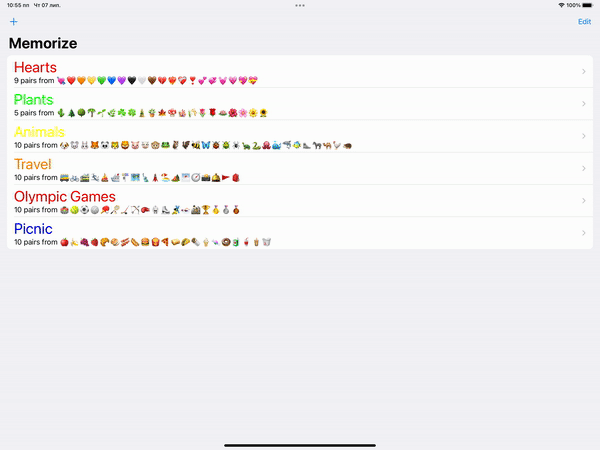

 # 📱Memorize Themes in SwiftUI:

## 🗂Required Tasks:

✅ Your game from A2 should no longer choose a random theme, instead, its ViewModel should have a theme var that can be set. Other than using this theme var to configure the game, your EmojiMemoryGame ViewModel should not have any other theme-related code in it (i.e. no initializing of themes, storing of themes, etc.).  
✅ When the theme var in your EmojiMemoryGame ViewModel is set to something that was different than it was before, you should restart the game (i.e. the equivalent of hitting the New Game button).  
✅ Your Memorize application should now show a “theme chooser” UI when it launches. See the video from Lecture 1 for some ideas, but your UI does not have to look exactly like what is shown there.  
✅ Use a List to display the themes.  
✅ Each row in the List shows the name of the theme, the color of the theme, how many cards in the theme and some sampling of the emoji in the theme.  
✅ Touching on a theme in the List navigates (i.e. the List is in a NavigationView) to playing a game with that theme.  
✅ While playing a game, the name of the theme should be on screen somewhere and you should also continue to support existing functionality like score, new game, etc. (but you may rearrange the UI to be different from A2’s version if you wish).  
✅ Navigating from being in the middle of playing a game back to the theme chooser and then back to the game should not restart that game unless the theme for that game was changed (i.e. because of Required Task 2).  
✅ Provide some UI to add a new theme to the List in your chooser.  
✅ The chooser must support an Edit Mode where you can delete themes and where tapping on the row will bring up a modally-presented (i.e. via sheet or popover) theme editor UI for that theme rather than navigating to playing a game with that theme.  
✅ The theme editor must use a Form.  
✅ In the theme editor, allow the user to edit the name of the theme, to add emoji to the theme, to remove emoji from the theme, to specify how many cards are in the theme and to specify the color of the theme.  
✅ The themes must be persistent (i.e. relaunching your app should not cause all the theme editing you’ve done to be lost).  
✅ Your UI should work and look nice on both iPhone and iPad.  
✅ Get your application work on a physical iOS device of your choice.  

## 📎Extra Credit:

✅ Keep track of any emoji that a user removes from a theme as a “removed” or “not included” emoji. Then enhance your theme editor to allow them to put removed emoji back if they change their mind. Remember these removed emoji forever (i.e. you will have to add state to your theme struct).  
